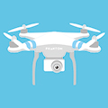
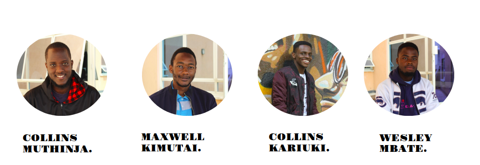
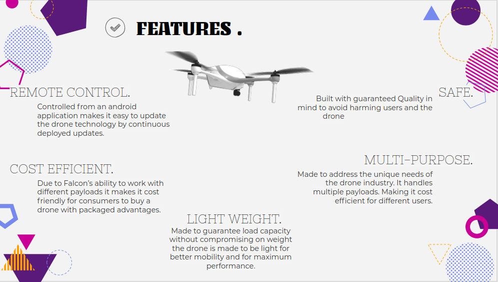

# FALCON ONE! :helicopter::dash:

## PROBLEM STATEMENT

With the recent advancement in technology the commercial drone industry demands an innovative and cost-effective solution to help the end-user in all applications of drones and their fields. 

## DESCRIPTION 

Falcon 1 is a light-weight Quadcopter that is safe and can be used Multi-purposely due to its endurance and load capacity

## DISCLAIMER :warning:

THIS PRODUCT IS SOLEY OWNED BY FALCON ONE AND SHOULD NOT IN ANY WAY BE PRODUCED ANYWHERE ELSE UNLESS UNDER AUTHORIZATION BY ALL FALCON ONE CREATORS:exclamation:

## AUTHORS :memo:

**[Collins Muthinja](https://github.com/Magz8984)**

**[Maxwell Kimutai](https://github.com/maxwellkimutai)**

**[Collins Kariuki](https://github.com/zecollokaris)**

**[Wesley Mbate](https://github.com/Wess58)**

## PROGRESS MADE

:pushpin: **Conducted Research**

:pushpin: **Acquired Hardware**

:pushpin: **Assembled Frame**

:pushpin: **Calibrated the ESC's**

:pushpin: **Made Android Application**

:pushpin: **Connected Application to Micro Controllers**

:pushpin: **Came up with the final circuits**

:pushpin: **Achieved first flight**

## TECHNOLOGIES USED

### :open_file_folder: SOFTWARE

1. Android Development

2. Java Programming Language

3. C Programming Language

### :open_file_folder: HARDWARE

1. MPU-6050

2. ESP-8266 Node MCU

3. Quadcopter Kit

## CHALLENGES FACED

- Callibrating the **MPU-6050** which contains the gyroscope for maximum flight staability.

**Note**

This project is still under development and the challenges may have been solved.

## FUTURE IMPLEMENTATIONS

:small_blue_diamond: Register a company and start production.

:small_blue_diamond: Increase signal transmission range for Falcon one.

:small_blue_diamond: Enter semi-autonomous state for falcon one.

:small_blue_diamond: Increase battery Flight time.

:small_blue_diamond: Start production of other drones to satisfy a huge demanding market. 

## FEATURES!

