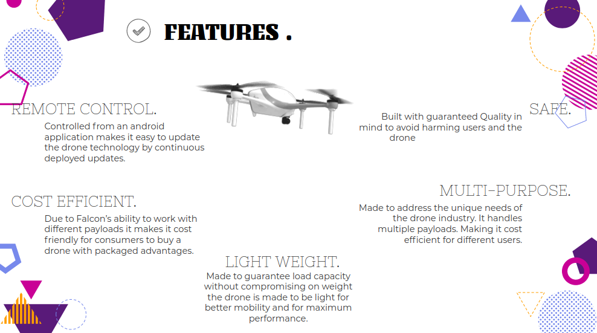

# FALCON ONE! :helicopter::dash:

## PROBLEM STATEMENT

With the recent advancement in technology the commercial drone industry demands an innovative and cost-effective solution to help the end-user in all applications of drones and their fields. 

## DESCRIPTION 

Falcon one is a light-weight Quadcopter that is safe and can be used Multi-purposely due to its endurance and load capacity

## DISCLAIMER :warning:

THIS PRODUCT IS SOLEY OWNED BY FALCON ONE AND SHOULD NOT IN ANY WAY BE PRODUCED ANYWHERE ELSE UNLESS UNDER AUTHORIZATION BY ALL FALCON ONE CREATORS:exclamation:

## AUTHORS :memo:

**[Collins Muthinja](https://github.com/Magz8984)**

**[Maxwell Kimutai](https://github.com/maxwellkimutai)**

**[Collins Kariuki](https://github.com/zecollokaris)**

**[Wesley Mbate](https://github.com/Wess58)**

## PROGRESS MADE

:pushpin: **Conducted Research**

:pushpin: **Acquired Hardware**

:pushpin: **Assembled Frame**

:pushpin: **Calibrated the ESC's**

:pushpin: **Made Android Application**

:pushpin: **Connected Application to Micro Controllers**

:pushpin: **Came up with the final circuits**

:pushpin: **Achieved first flight**

## HOW IT WORKS :rocket:

The **drone** controlled by an **Adnroid application** connected via **WI-FI and tcp/ip protocol**. It has 3 main units **hardware, firmware and the mobile application**. As for hardware **rotors** are conected to **ESC's (Electronic Speed Controllers)**, the **ESC's** are connected to an **ESP-8266 micro controller** via pmw pins that send analog signals to the escs to allow voltages to **rotors**.

**Bearing in mind it is a quadcopter** we have a **4 ESC's** all draining our **LiPo battery through it has a high discarge rate**, we have a **fiberglass pcb with copper linings** to provide a **PDB(Power distribution board)** for our **ESC's**.

In addition to **hardware we have an MPU-6050** 6 degrees of freedom to measure both linear acceleration an orientation to provide an automated **flight stabilization method**.

For the **firmware it is uploaded as a sketch** to our **micro controller via serial com from a laptop**. **C and C++ code is used to program the EEPROM**. Code is all written from **scratch** made user friendly, mobile and upgradable. The **android app is written in Java** using **http methods to send post requests to our micro controller** to control rpms of **rotors** by the **arduino Servo lib**.

## TECHNOLOGIES USED

### :open_file_folder: FIRMWARE

1. Android Development

2. Java Programming Language

3. C Programming Language

### :open_file_folder: HARDWARE

1. MPU-6050

2. ESP-8266 Node MCU

3. Quadcopter Kit

## CHALLENGES FACED

- Callibrating the **MPU-6050** which contains the gyroscope for maximum flight staability.

**Note**

This project is still under development and the challenges may have been solved.

## FUTURE IMPLEMENTATIONS

:small_blue_diamond: Register a company and start production.

:small_blue_diamond: Increase signal transmission range for Falcon one.

:small_blue_diamond: Enter semi-autonomous state for falcon one.

:small_blue_diamond: Increase battery Flight time.

:small_blue_diamond: Start production of other drones to satisfy a huge demanding market. 

## FEATURES

## CONTACT

This Repository is constantly being updated to keep up with the work. Feel free to contact for more information.

:telephone_receiver: **Collins Magondu** +254 753 924273

:incoming_envelope: **Collins Kariuki** collo.kariss@gmail.com